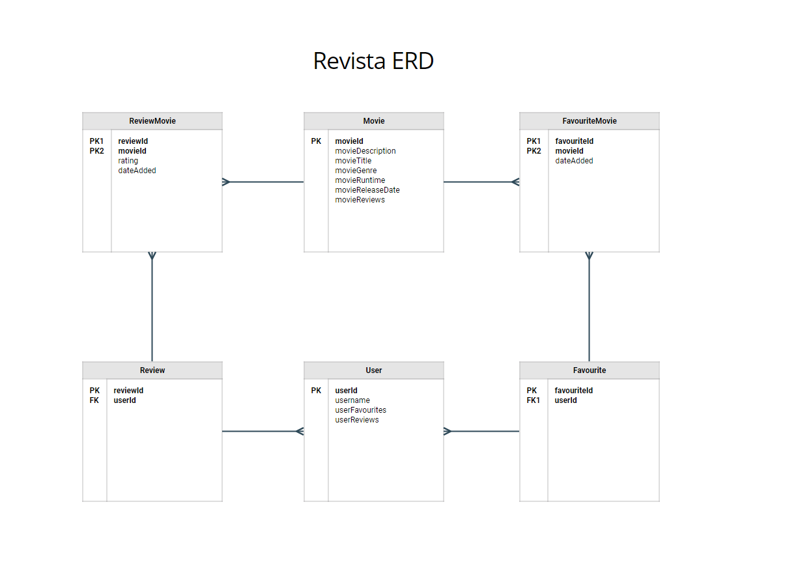

#### .Net Project 2020

<div align="center">

## :popcorn::popcorn::popcorn: Revista :popcorn::popcorn::popcorn:

##### Thelma Palma, Anthony Chan, Nick Charvat, Yaroslav Naftulyev, Chris Bayne

</div>

<br>


<strong>App Description: </strong>
An online movie database website using a movie api where <br> a user can register for an account to login to rate, favourite, and review movies.

<br>


<details>
<summary>Detailed Installation Instructions Here</summary>
<br>
- To run this app you'll first want to clone the repository into your Visual Studio.
<br>
- Once you've cloned the repository, find the appsettings.json file in the Solution Explorer menu.
- Under "Connection Strings", title the first connection "MovieDbContextConnection" and name the database RevistaMovieDb.
<br>
- Title the second connection "AuthDbContextConnection" and name the database RevistaAuthDb.
<br>
- Make sure to add your server name to both connections.
<br>
- Your appsetting connections should look like the following:
<br><br>

`"ConnectionStrings": {
        "MovieDbContextConnection": "Server=[YOUR-SERVER-NAME-HERE];Database=RevistaMovieDb;Trusted_Connection=True;MultipleActiveResultSets=true",
        "AuthDbContextConnection": "Server=[YOUR-SERVER-NAME-HERE];Database=RevistaAuthDb;Trusted_Connection=True;MultipleActiveResultSets=true"
    },`
- From the Tools menu, open the Package Manager Console and type the following: 

`Add-Migration InitialAuthSchema -Context MovieDbContext -OutputDir "Areas/Identity/Data/Migrations"`

- Do the same for AuthDbContext: 

`Add-Migration InitialAuthSchema -Context AuthDbContext -OutputDir "Areas/Identity/Data/Migrations"`
- Next, open Microsoft SQL Server Management Studio and connect to your server.
- Expand the main Databases folder to find your newly created databases named RevistaMovieDb and RevistaAuthDb.
- In the RevistaMovieDb, expand the tables folder to find dbo.Movies. Right click and Select Top 1000 Rows.
- Insert the following movie seed data and execute.
<br>
<details>
<summary>SEED DATA</summary>

```
-- Popular

INSERT INTO Movies(CategoryId,GenreId,MovieId,Overview,PosterPath,ReleaseDate,Title) VALUES (1,28,590706,'Every six years, an ancient order of jiu-jitsu fighters joins forces to battle a vicious race of alien invaders. But when a celebrated war hero goes down in defeat, the fate of the planet and mankind hangs in the balance.','/eLT8Cu357VOwBVTitkmlDEg32Fs.jpg','2020-11-20','Jiu Jitsu');
INSERT INTO Movies(CategoryId,GenreId,MovieId,Overview,PosterPath,ReleaseDate,Title) VALUES (1,27,590995,'An eclectic foursome of aspiring teenage witches get more than they bargained for as they lean into their newfound powers.','/lhMIra0pqWNuD6CIXoTmGwZ0EBS.jpg','2020-10-28','The Craft: Legacy');
INSERT INTO Movies(CategoryId,GenreId,MovieId,Overview,PosterPath,ReleaseDate,Title) VALUES (1,53,646593,'After getting hired to probe a suspicious death in the small town of Wander, a mentally unstable private investigator becomes convinced the case is linked to the same ''conspiracy cover up'' that caused the death of his daughter.','/2AwPvNHphpZBJDqjZKVuMAbvS0v.jpg','2020-12-04','Wander');
INSERT INTO Movies(CategoryId,GenreId,MovieId,Overview,PosterPath,ReleaseDate,Title) VALUES (1,28,602211,'A rowdy, unorthodox Santa Claus is fighting to save his declining business. Meanwhile, Billy, a neglected and precocious 12 year old, hires a hit man to kill Santa after receiving a lump of coal in his stocking.','/4n8QNNdk4BOX9Dslfbz5Dy6j1HK.jpg','2020-11-13','Fatman');
INSERT INTO Movies(CategoryId,GenreId,MovieId,Overview,PosterPath,ReleaseDate,Title) VALUES (1,27,294963,'During a shootout in a saloon, Sheriff Hunt injures a suspicious stranger. One of the villagers takes care of him in prison. One day they both disappear – only the spear of a cannibal tribe is found. Hunt and a few of his men go in search of the prisoner and his nurse.','/4MmTHpn2Y8emqvBgvOjufImUmKZ.jpg','2015-10-23','Bone Tomahawk');
INSERT INTO Movies(CategoryId,GenreId,MovieId,Overview,PosterPath,ReleaseDate,Title) VALUES (1,14,531219,'In late 1967, a young orphaned boy goes to live with his loving grandma in the rural Alabama town of Demopolis. As the boy and his grandmother encounter some deceptively glamorous but thoroughly diabolical witches, she wisely whisks him away to a seaside resort. Regrettably, they arrive at precisely the same time that the world''s Grand High Witch has gathered.','/betExZlgK0l7CZ9CsCBVcwO1OjL.jpg','2020-10-26','Roald Dahl''s The Witches');
INSERT INTO Movies(CategoryId,GenreId,MovieId,Overview,PosterPath,ReleaseDate,Title) VALUES (1,28,682377,'When Anna Wyncomb is introduced to an an underground, all-female fight club in order to turn the mess of her life around, she discovers she is much more personally connected to the history of the club than she could ever imagine.','/4ZocdxnOO6q2UbdKye2wgofLFhB.jpg','2020-11-13','Chick Fight');
INSERT INTO Movies(CategoryId,GenreId,MovieId,Overview,PosterPath,ReleaseDate,Title) VALUES (1,28,577922,'Armed with only one word - Tenet - and fighting for the survival of the entire world, the Protagonist journeys through a twilight world of international espionage on a mission that will unfold in something beyond real time.','/k68nPLbIST6NP96JmTxmZijEvCA.jpg','2020-08-22','Tenet');
INSERT INTO Movies(CategoryId,GenreId,MovieId,Overview,PosterPath,ReleaseDate,Title) VALUES (1,37,729648,'When their brother Frank is killed by an outlaw, brothers Bob Dalton, Emmett Dalton and Gray Dalton join their local sheriff''s department. When they are cheated by the law, they turn to crime, robbing trains and anything else they can steal from over the course of two years in the early 1890''s. Trying to out do Jesse James, they attempt to rob two banks at once in October of 1892, and things get ugly','/6OeGqp18oZucUGziMIRNhLouZ75.jpg','2020-11-02','The Dalton Gang');
INSERT INTO Movies(CategoryId,GenreId,MovieId,Overview,PosterPath,ReleaseDate,Title) VALUES (1,28,724989,'The work of billionaire tech CEO Donovan Chalmers is so valuable that he hires mercenaries to protect it, and a terrorist group kidnaps his daughter just to get it.','/ugZW8ocsrfgI95pnQ7wrmKDxIe.jpg','2020-10-23','Hard Kill');
INSERT INTO Movies(CategoryId,GenreId,MovieId,Overview,PosterPath,ReleaseDate,Title) VALUES (1,878,722603,'Weekend campers, an escaped convict, young lovers and a police officer experience a night of terror when a hostile visitor from another world descends on a small Arizona town.','/w6e0XZreiyW4mGlLRHEG8ipff7b.jpg','2020-07-07','Battlefield 2025');
INSERT INTO Movies(CategoryId,GenreId,MovieId,Overview,PosterPath,ReleaseDate,Title) VALUES (1,28,553604,'A bank robber tries to turn himself in because he''s falling in love and wants to live an honest life...but when he realizes the Feds are more corrupt than him, he must fight back to clear his name.','/zeD4PabP6099gpE0STWJrJrCBCs.jpg','2020-09-03','Honest Thief');
INSERT INTO Movies(CategoryId,GenreId,MovieId,Overview,PosterPath,ReleaseDate,Title) VALUES (1,10751,662546,'A young and unskilled fairy godmother that ventures out on her own to prove her worth by tracking down a young girl whose request for help was ignored. What she discovers is that the girl has now become a grown woman in need of something very different than a "prince charming."','/ir8Qqi90mENhH7CDxEpdeCcm6UL.jpg','2020-12-04','Godmothered');
INSERT INTO Movies(CategoryId,GenreId,MovieId,Overview,PosterPath,ReleaseDate,Title) VALUES (1,35,765123,'A man foils an attempted murder, then flees the crew of would-be killers along with their intended target as a woman he''s just met tries to find him.','/ajKpYK7XdzIYjy9Uy8nkgRboKyv.jpg','2020-12-04','Christmas Crossfire');
INSERT INTO Movies(CategoryId,GenreId,MovieId,Overview,PosterPath,ReleaseDate,Title) VALUES (1,53,671039,'Caught in the crosshairs of police corruption and Marseille’s warring gangs, a loyal cop must protect his squad by taking matters into his own hands.','/9HT9982bzgN5on1sLRmc1GMn6ZC.jpg','2020-10-30','Rogue City');
INSERT INTO Movies(CategoryId,GenreId,MovieId,Overview,PosterPath,ReleaseDate,Title) VALUES (1,16,752455,'A determined Angela makes a wish to reunite her family in time for Christmas, then launches a plan to find her way from Ireland to Australia.','/eu747ko823mktL3ygo7ohdZznP7.jpg','2020-12-01','Angela''s Christmas Wish');
INSERT INTO Movies(CategoryId,GenreId,MovieId,Overview,PosterPath,ReleaseDate,Title) VALUES (1,28,524047,'John Garrity, his estranged wife and their young son embark on a perilous journey to find sanctuary as a planet-killing comet hurtles toward Earth. Amid terrifying accounts of cities getting levelled, the Garrity''s experience the best and worst in humanity. As the countdown to the global apocalypse approaches zero, their incredible trek culminates in a desperate and last-minute flight to a possible safe haven.','/bNo2mcvSwIvnx8K6y1euAc1TLVq.jpg','2020-07-29','Greenland');
INSERT INTO Movies(CategoryId,GenreId,MovieId,Overview,PosterPath,ReleaseDate,Title) VALUES (1,28,741067,'Jesse Freeman is a former special forces officer and explosives expert now working a regular job as a security guard in a state-of-the-art basketball arena. Trouble erupts when a tech-savvy cadre of terrorists kidnap the team''s owner and Jesse''s daughter during opening night. Facing a ticking clock and impossible odds, it''s up to Jesse to not only save them but also a full house of fans in this highly charged action thriller.','/elZ6JCzSEvFOq4gNjNeZsnRFsvj.jpg','2020-09-29','Welcome to Sudden Death');
INSERT INTO Movies(CategoryId,GenreId,MovieId,Overview,PosterPath,ReleaseDate,Title) VALUES (1,27,753926,'A big family moves into a dusty old house in the snowy woods of Washington with hopes of it being a nice holiday escape. But the kids soon discover a stash of old toys that just so happen to belong to a creepy ghost boy. As stranger and stranger things start to happen, some of the kids begin to sense that something in the house is not quite right…','/c6hmAgPVXxZHwMHfS9z3W2n9Gz9.jpg','2020-10-18','Toys of Terror');
INSERT INTO Movies(CategoryId,GenreId,MovieId,Overview,PosterPath,ReleaseDate,Title) VALUES (1,28,581392,'A soldier and his team battle hordes of post-apocalyptic zombies in the wastelands of the Korean Peninsula.','/sy6DvAu72kjoseZEjocnm2ZZ09i.jpg','2020-07-15','Peninsula');

-- Top Rated
INSERT INTO Movies(CategoryId,MovieId,Overview,PosterPath,ReleaseDate,Title,GenreId) VALUES (2,761053,'The final part of the film adaption of the erotic romance novel Gabriel''s Inferno written by an anonymous Canadian author under the pen name Sylvain Reynard.','/qtX2Fg9MTmrbgN1UUvGoCsImTM8.jpg','2020-11-19','Gabriel''s Inferno Part III',10749);
INSERT INTO Movies(CategoryId,MovieId,Overview,PosterPath,ReleaseDate,Title,GenreId) VALUES (2,724089,'Professor Gabriel Emerson finally learns the truth about Julia Mitchell''s identity, but his realization comes a moment too late. Julia is done waiting for the well-respected Dante specialist to remember her and wants nothing more to do with him. Can Gabriel win back her heart before she finds love in another''s arms?','/pci1ArYW7oJ2eyTo2NMYEKHHiCP.jpg','2020-07-31','Gabriel''s Inferno Part II',10749);
INSERT INTO Movies(CategoryId,MovieId,Overview,PosterPath,ReleaseDate,Title,GenreId) VALUES (2,696374,'An intriguing and sinful exploration of seduction, forbidden love, and redemption, Gabriel''s Inferno is a captivating and wildly passionate tale of one man''s escape from his own personal hell as he tries to earn the impossible--forgiveness and love.','/oyG9TL7FcRP4EZ9Vid6uKzwdndz.jpg','2020-05-29','Gabriel''s Inferno',10749);
INSERT INTO Movies(CategoryId,MovieId,Overview,PosterPath,ReleaseDate,Title,GenreId) VALUES (2,278,'Framed in the 1940s for the double murder of his wife and her lover, upstanding banker Andy Dufresne begins a new life at the Shawshank prison, where he puts his accounting skills to work for an amoral warden. During his long stretch in prison, Dufresne comes to be admired by the other inmates -- including an older prisoner named Red -- for his integrity and unquenchable sense of hope.','/q6y0Go1tsGEsmtFryDOJo3dEmqu.jpg','1994-09-23','The Shawshank Redemption',18);
INSERT INTO Movies(CategoryId,MovieId,Overview,PosterPath,ReleaseDate,Title,GenreId) VALUES (2,238,'Spanning the years 1945 to 1955, a chronicle of the fictional Italian-American Corleone crime family. When organized crime family patriarch, Vito Corleone barely survives an attempt on his life, his youngest son, Michael steps in to take care of the would-be killers, launching a campaign of bloody revenge.','/3bhkrj58Vtu7enYsRolD1fZdja1.jpg','1972-03-14','The Godfather',18);
INSERT INTO Movies(CategoryId,MovieId,Overview,PosterPath,ReleaseDate,Title,GenreId) VALUES (2,19404,'Raj is a rich, carefree, happy-go-lucky second generation NRI. Simran is the daughter of Chaudhary Baldev Singh, who in spite of being an NRI is very strict about adherence to Indian values. Simran has left for India to be married to her childhood fiancé. Raj leaves for India with a mission at his hands, to claim his lady love under the noses of her whole family. Thus begins a saga.','/2CAL2433ZeIihfX1Hb2139CX0pW.jpg','1995-10-20','Dilwale Dulhania Le Jayenge',35);
INSERT INTO Movies(CategoryId,MovieId,Overview,PosterPath,ReleaseDate,Title,GenreId) VALUES (2,644479,'The film tells the story of Ariel, a 21-year-old who decides to form a rock band to compete for a prize of ten thousand dollars in a musical band contest, this as a last option when trying to get money to save their relationship and reunite with his ex-girlfriend, which breaks due to the trip she must make to Finland for an internship. Ariel with her friend Ortega, decides to make a casting to find the other members of the band, although they do not know nothing about music, thus forming a band with members that have diverse and opposite personalities.','/riAooJrFvVhotyaOgoI0WR7okSe.jpg','2019-11-01','Dedicated to my ex',35);
INSERT INTO Movies(CategoryId,MovieId,Overview,PosterPath,ReleaseDate,Title,GenreId) VALUES (2,424,'The true story of how businessman Oskar Schindler saved over a thousand Jewish lives from the Nazis while they worked as slaves in his factory during World War II.','/c8Ass7acuOe4za6DhSattE359gr.jpg','1993-11-30','Schindler''s List',18);
INSERT INTO Movies(CategoryId,MovieId,Overview,PosterPath,ReleaseDate,Title,GenreId) VALUES (2,372058,'High schoolers Mitsuha and Taki are complete strangers living separate lives. But one night, they suddenly switch places. Mitsuha wakes up in Taki’s body, and he in hers. This bizarre occurrence continues to happen randomly, and the two must adjust their lives around each other.','/q719jXXEzOoYaps6babgKnONONX.jpg','2016-08-26','Your Name.',10749);
INSERT INTO Movies(CategoryId,MovieId,Overview,PosterPath,ReleaseDate,Title,GenreId) VALUES (2,240,'In the continuing saga of the Corleone crime family, a young Vito Corleone grows up in Sicily and in 1910s New York. In the 1950s, Michael Corleone attempts to expand the family business into Las Vegas, Hollywood and Cuba.','/hek3koDUyRQk7FIhPXsa6mT2Zc3.jpg','1974-12-20','The Godfather: Part II',18);
INSERT INTO Movies(CategoryId,MovieId,Overview,PosterPath,ReleaseDate,Title,GenreId) VALUES (2,129,'A young girl, Chihiro, becomes trapped in a strange new world of spirits. When her parents undergo a mysterious transformation, she must call upon the courage she never knew she had to free her family.','/2TeJfUZMGolfDdW6DKhfIWqvq8y.jpg','2001-07-20','Spirited Away',16);
INSERT INTO Movies(CategoryId,MovieId,Overview,PosterPath,ReleaseDate,Title,GenreId) VALUES (2,496243,'All unemployed, Ki-taek''s family takes peculiar interest in the wealthy and glamorous Parks for their livelihood until they get entangled in an unexpected incident.','/7IiTTgloJzvGI1TAYymCfbfl3vT.jpg','2019-05-30','Parasite',35);
INSERT INTO Movies(CategoryId,MovieId,Overview,PosterPath,ReleaseDate,Title,GenreId) VALUES (2,497,'A supernatural tale set on death row in a Southern prison, where gentle giant John Coffey possesses the mysterious power to heal people''s ailments. When the cell block''s head guard, Paul Edgecomb, recognizes Coffey''s miraculous gift, he tries desperately to help stave off the condemned man''s execution.','/velWPhVMQeQKcxggNEU8YmIo52R.jpg','1999-12-10','The Green Mile',14);
INSERT INTO Movies(CategoryId,MovieId,Overview,PosterPath,ReleaseDate,Title,GenreId) VALUES (2,592350,'Class 1-A visits Nabu Island where they finally get to do some real hero work. The place is so peaceful that it''s more like a vacation … until they''re attacked by a villain with an unfathomable Quirk! His power is eerily familiar, and it looks like Shigaraki had a hand in the plan. But with All Might retired and citizens'' lives on the line, there''s no time for questions. Deku and his friends are the next generation of heroes, and they''re the island''s only hope.','/zGVbrulkupqpbwgiNedkJPyQum4.jpg','2019-12-20','My Hero Academia: Heroes Rising',16);
INSERT INTO Movies(CategoryId,MovieId,Overview,PosterPath,ReleaseDate,Title,GenreId) VALUES (2,680,'A burger-loving hit man, his philosophical partner, a drug-addled gangster''s moll and a washed-up boxer converge in this sprawling, comedic crime caper. Their adventures unfurl in three stories that ingeniously trip back and forth in time.','/dRZpdpKLgN9nk57zggJCs1TjJb4.jpg','1994-09-10','Pulp Fiction',53);
INSERT INTO Movies(CategoryId,MovieId,Overview,PosterPath,ReleaseDate,Title,GenreId) VALUES (2,637,'A touching story of an Italian book seller of Jewish ancestry who lives in his own little fairy tale. His creative and happy life would come to an abrupt halt when his entire family is deported to a concentration camp during World War II. While locked up he tries to convince his son that the whole thing is just a game.','/74hLDKjD5aGYOotO6esUVaeISa2.jpg','1997-12-20','Life Is Beautiful',35);
INSERT INTO Movies(CategoryId,MovieId,Overview,PosterPath,ReleaseDate,Title,GenreId) VALUES (2,122,'Aragorn is revealed as the heir to the ancient kings as he, Gandalf and the other members of the broken fellowship struggle to save Gondor from Sauron''s forces. Meanwhile, Frodo and Sam take the ring closer to the heart of Mordor, the dark lord''s realm.','/rCzpDGLbOoPwLjy3OAm5NUPOTrC.jpg','2003-12-01','The Lord of the Rings: The Return of the King',12);
INSERT INTO Movies(CategoryId,MovieId,Overview,PosterPath,ReleaseDate,Title,GenreId) VALUES (2,630566,'Young musician Zach Sobiech discovers his cancer has spread, leaving him just a few months to live. With limited time, he follows his dream and makes an album, unaware that it will soon be a viral music phenomenon.','/2YvT3pdGngzpbAuxamTz4ZlabnT.jpg','2020-10-09','Clouds',10402);
INSERT INTO Movies(CategoryId,MovieId,Overview,PosterPath,ReleaseDate,Title,GenreId) VALUES (2,13,'A man with a low IQ has accomplished great things in his life and been present during significant historic events—in each case, far exceeding what anyone imagined he could do. But despite all he has achieved, his one true love eludes him.','/h5J4W4veyxMXDMjeNxZI46TsHOb.jpg','1994-07-06','Forrest Gump',35);
INSERT INTO Movies(CategoryId,MovieId,Overview,PosterPath,ReleaseDate,Title,GenreId) VALUES (2,556574,'Presenting the tale of American founding father Alexander Hamilton, this filmed version of the original Broadway smash hit is the story of America then, told by America now.','/h1B7tW0t399VDjAcWJh8m87469b.jpg','2020-07-03','Hamilton',36);

-- Now Playing
INSERT INTO Movies(CategoryId,GenreId,MovieId,Overview,PosterPath,ReleaseDate,Title) VALUES (3,28,590706,'Every six years, an ancient order of jiu-jitsu fighters joins forces to battle a vicious race of alien invaders. But when a celebrated war hero goes down in defeat, the fate of the planet and mankind hangs in the balance.','/eLT8Cu357VOwBVTitkmlDEg32Fs.jpg','2020-11-20','Jiu Jitsu');
INSERT INTO Movies(CategoryId,GenreId,MovieId,Overview,PosterPath,ReleaseDate,Title) VALUES (3,28,602211,'A rowdy, unorthodox Santa Claus is fighting to save his declining business. Meanwhile, Billy, a neglected and precocious 12 year old, hires a hit man to kill Santa after receiving a lump of coal in his stocking.','/4n8QNNdk4BOX9Dslfbz5Dy6j1HK.jpg','2020-11-13','Fatman');
INSERT INTO Movies(CategoryId,GenreId,MovieId,Overview,PosterPath,ReleaseDate,Title) VALUES (3,27,590995,'An eclectic foursome of aspiring teenage witches get more than they bargained for as they lean into their newfound powers.','/lhMIra0pqWNuD6CIXoTmGwZ0EBS.jpg','2020-10-28','The Craft: Legacy');
INSERT INTO Movies(CategoryId,GenreId,MovieId,Overview,PosterPath,ReleaseDate,Title) VALUES (3,37,729648,'When their brother Frank is killed by an outlaw, brothers Bob Dalton, Emmett Dalton and Gray Dalton join their local sheriff''s department. When they are cheated by the law, they turn to crime, robbing trains and anything else they can steal from over the course of two years in the early 1890''s. Trying to out do Jesse James, they attempt to rob two banks at once in October of 1892, and things get ugly','/6OeGqp18oZucUGziMIRNhLouZ75.jpg','2020-11-02','The Dalton Gang');
INSERT INTO Movies(CategoryId,GenreId,MovieId,Overview,PosterPath,ReleaseDate,Title) VALUES (3,28,577922,'Armed with only one word - Tenet - and fighting for the survival of the entire world, the Protagonist journeys through a twilight world of international espionage on a mission that will unfold in something beyond real time.','/k68nPLbIST6NP96JmTxmZijEvCA.jpg','2020-08-22','Tenet');
INSERT INTO Movies(CategoryId,GenreId,MovieId,Overview,PosterPath,ReleaseDate,Title) VALUES (3,53,646593,'After getting hired to probe a suspicious death in the small town of Wander, a mentally unstable private investigator becomes convinced the case is linked to the same ''conspiracy cover up'' that caused the death of his daughter.','/2AwPvNHphpZBJDqjZKVuMAbvS0v.jpg','2020-12-04','Wander');
INSERT INTO Movies(CategoryId,GenreId,MovieId,Overview,PosterPath,ReleaseDate,Title) VALUES (3,53,671039,'Caught in the crosshairs of police corruption and Marseille’s warring gangs, a loyal cop must protect his squad by taking matters into his own hands.','/9HT9982bzgN5on1sLRmc1GMn6ZC.jpg','2020-10-30','Rogue City');
INSERT INTO Movies(CategoryId,GenreId,MovieId,Overview,PosterPath,ReleaseDate,Title) VALUES (3,14,531219,'In late 1967, a young orphaned boy goes to live with his loving grandma in the rural Alabama town of Demopolis. As the boy and his grandmother encounter some deceptively glamorous but thoroughly diabolical witches, she wisely whisks him away to a seaside resort. Regrettably, they arrive at precisely the same time that the world''s Grand High Witch has gathered.','/betExZlgK0l7CZ9CsCBVcwO1OjL.jpg','2020-10-26','Roald Dahl''s The Witches');
INSERT INTO Movies(CategoryId,GenreId,MovieId,Overview,PosterPath,ReleaseDate,Title) VALUES (3,28,524047,'John Garrity, his estranged wife and their young son embark on a perilous journey to find sanctuary as a planet-killing comet hurtles toward Earth. Amid terrifying accounts of cities getting levelled, the Garrity''s experience the best and worst in humanity. As the countdown to the global apocalypse approaches zero, their incredible trek culminates in a desperate and last-minute flight to a possible safe haven.','/bNo2mcvSwIvnx8K6y1euAc1TLVq.jpg','2020-07-29','Greenland');
INSERT INTO Movies(CategoryId,GenreId,MovieId,Overview,PosterPath,ReleaseDate,Title) VALUES (3,28,581392,'A soldier and his team battle hordes of post-apocalyptic zombies in the wastelands of the Korean Peninsula.','/sy6DvAu72kjoseZEjocnm2ZZ09i.jpg','2020-07-15','Peninsula');
INSERT INTO Movies(CategoryId,GenreId,MovieId,Overview,PosterPath,ReleaseDate,Title) VALUES (3,10751,654028,'Kate Pierce is reluctantly spending Christmas with her mom’s new boyfriend and his son Jack. But when the North Pole and Christmas are threatened to be destroyed, Kate and Jack are unexpectedly pulled into a new adventure with Santa Claus.','/6sG0kbEvAi3RRLcGGU5h8l3qAPa.jpg','2020-11-18','The Christmas Chronicles: Part Two');
INSERT INTO Movies(CategoryId,GenreId,MovieId,Overview,PosterPath,ReleaseDate,Title) VALUES (3,35,650747,'This satirical anthology tells the surreal stories of a gift for Don Horacio, a trip to the beach for Bermejo, a life-changing relationship between Tina and the young immigrant Ayoub, and a new client for a company that specializes in excuses.','/vijoU09NBYoQ5VpawXj2AfGOmCw.jpg','2020-11-19','Historias lamentables');
INSERT INTO Movies(CategoryId,GenreId,MovieId,Overview,PosterPath,ReleaseDate,Title) VALUES (3,28,553604,'A bank robber tries to turn himself in because he''s falling in love and wants to live an honest life...but when he realizes the Feds are more corrupt than him, he must fight back to clear his name.','/zeD4PabP6099gpE0STWJrJrCBCs.jpg','2020-09-03','Honest Thief');
INSERT INTO Movies(CategoryId,GenreId,MovieId,Overview,PosterPath,ReleaseDate,Title) VALUES (3,27,551804,'A mystical, ancient dagger causes a notorious serial killer to magically switch bodies with a 17-year-old girl.','/8xC6QSyxrpm0D5A6iyHNemEWBVe.jpg','2020-11-12','Freaky');
INSERT INTO Movies(CategoryId,GenreId,MovieId,Overview,PosterPath,ReleaseDate,Title) VALUES (3,12,529203,'After leaving their cave, the Croods encounter their biggest threat since leaving: another family called the Bettermans, who claim and show to be better and evolved. Grug grows suspicious of the Betterman parents, Phil and Hope,  as they secretly plan to break up his daughter Eep with her loving boyfriend Guy to ensure that their daughter Dawn has a loving and smart partner to protect her.','/tK1zy5BsCt1J4OzoDicXmr0UTFH.jpg','2020-11-25','The Croods: A New Age');
INSERT INTO Movies(CategoryId,GenreId,MovieId,Overview,PosterPath,ReleaseDate,Title) VALUES (3,18,726208,'After the strange death of his young son at their new home, Daniel hears a ghostly plea for help, spurring him to seek out a renowned paranormal expert.','/ffdPUteSePSqJEhKJKwgSIWumC2.jpg','2020-07-24','Don''t Listen');
INSERT INTO Movies(CategoryId,GenreId,MovieId,Overview,PosterPath,ReleaseDate,Title) VALUES (3,10751,622855,'An imaginary world comes to life in a holiday tale of an eccentric toymaker, his adventurous granddaughter, and a magical invention that has the power to change their lives forever.','/5RbyHIVydD3Krmec1LlUV7rRjet.jpg','2020-11-06','Jingle Jangle: A Christmas Journey');
INSERT INTO Movies(CategoryId,GenreId,MovieId,Overview,PosterPath,ReleaseDate,Title) VALUES (3,28,718444,'Battle-hardened O’Hara leads a lively mercenary team of soldiers on a daring mission: rescue hostages from their captors in remote Africa. But as the mission goes awry and the team is stranded, O’Hara’s squad must face a bloody, brutal encounter with a gang of rebels.','/uOw5JD8IlD546feZ6oxbIjvN66P.jpg','2020-08-20','Rogue');
INSERT INTO Movies(CategoryId,GenreId,MovieId,Overview,PosterPath,ReleaseDate,Title) VALUES (3,28,531499,'David Cuevas is a family man who works as a gangland tax collector for high ranking Los Angeles gang members. He makes collections across the city with his partner Creeper making sure people pay up or will see retaliation. An old threat returns to Los Angeles that puts everything David loves in harm’s way.','/3eg0kGC2Xh0vhydJHO37Sp4cmMt.jpg','2020-08-07','The Tax Collector');
INSERT INTO Movies(CategoryId,GenreId,MovieId,Overview,PosterPath,ReleaseDate,Title) VALUES (3,16,635302,'Tanjirō Kamado, joined with Inosuke Hashibira, a boy raised by boars who wears a boar''s head, and Zenitsu Agatsuma, a scared boy who reveals his true power when he sleeps, boards the Infinity Train on a new mission with the Fire Hashira, Kyōjurō Rengoku, to defeat a demon who has been tormenting the people and killing the demon slayers who oppose it!','/h8Rb9gBr48ODIwYUttZNYeMWeUU.jpg','2020-10-16','Demon Slayer the Movie: Mugen Train');

-- Upcoming
INSERT INTO Movies(CategoryId,GenreId,MovieId,Overview,PosterPath,ReleaseDate,Title) VALUES (4,28,602211,'A rowdy, unorthodox Santa Claus is fighting to save his declining business. Meanwhile, Billy, a neglected and precocious 12 year old, hires a hit man to kill Santa after receiving a lump of coal in his stocking.','/4n8QNNdk4BOX9Dslfbz5Dy6j1HK.jpg','2020-11-13','Fatman');
INSERT INTO Movies(CategoryId,GenreId,MovieId,Overview,PosterPath,ReleaseDate,Title) VALUES (4,14,531219,'In late 1967, a young orphaned boy goes to live with his loving grandma in the rural Alabama town of Demopolis. As the boy and his grandmother encounter some deceptively glamorous but thoroughly diabolical witches, she wisely whisks him away to a seaside resort. Regrettably, they arrive at precisely the same time that the world''s Grand High Witch has gathered.','/betExZlgK0l7CZ9CsCBVcwO1OjL.jpg','2020-10-26','Roald Dahl''s The Witches');
INSERT INTO Movies(CategoryId,GenreId,MovieId,Overview,PosterPath,ReleaseDate,Title) VALUES (4,27,551804,'A mystical, ancient dagger causes a notorious serial killer to magically switch bodies with a 17-year-old girl.','/8xC6QSyxrpm0D5A6iyHNemEWBVe.jpg','2020-11-12','Freaky');
INSERT INTO Movies(CategoryId,GenreId,MovieId,Overview,PosterPath,ReleaseDate,Title) VALUES (4,12,529203,'After leaving their cave, the Croods encounter their biggest threat since leaving: another family called the Bettermans, who claim and show to be better and evolved. Grug grows suspicious of the Betterman parents, Phil and Hope,  as they secretly plan to break up his daughter Eep with her loving boyfriend Guy to ensure that their daughter Dawn has a loving and smart partner to protect her.','/tK1zy5BsCt1J4OzoDicXmr0UTFH.jpg','2020-11-25','The Croods: A New Age');
INSERT INTO Movies(CategoryId,GenreId,MovieId,Overview,PosterPath,ReleaseDate,Title) VALUES (4,16,400160,'When his best friend Gary is suddenly snatched away, SpongeBob takes Patrick on a madcap mission far beyond Bikini Bottom to save their pink-shelled pal.','/jlJ8nDhMhCYJuzOw3f52CP1W8MW.jpg','2020-08-14','The SpongeBob Movie: Sponge on the Run');
INSERT INTO Movies(CategoryId,GenreId,MovieId,Overview,PosterPath,ReleaseDate,Title) VALUES (4,27,571384,'A lonely young boy feels different from everyone else. Desperate for a friend, he seeks solace and refuge in his ever-present cell phone and tablet. When a mysterious creature uses the boy’s devices against him to break into our world, his parents must fight to save their son from the monster beyond the screen.','/e98dJUitAoKLwmzjQ0Yxp1VQrnU.jpg','2020-10-28','Come Play');
INSERT INTO Movies(CategoryId,GenreId,MovieId,Overview,PosterPath,ReleaseDate,Title) VALUES (4,35,676838,'When the grandmother decides that it is time to put the family affairs in order, the fights begin to inherit the house. A sequel to ''Grandma''s Wedding''.','/h1BZHYQl3pGOgaGDK6zwrOsYIop.jpg','2020-10-09','El Testamento de la Abuela');
INSERT INTO Movies(CategoryId,GenreId,MovieId,Overview,PosterPath,ReleaseDate,Title) VALUES (4,10749,520172,'A young woman''s plans to propose to her girlfriend while at her family''s annual holiday party are upended when she discovers her partner hasn''t yet come out to her conservative parents.','/vzec9kkOSE93tygyfOktedkeOQ.jpg','2020-11-26','Happiest Season');
INSERT INTO Movies(CategoryId,GenreId,MovieId,Overview,PosterPath,ReleaseDate,Title) VALUES (4,35,425001,'Peter is thrilled that his Grandpa is coming to live with his family. That is, until Grandpa moves into Peter''s room, forcing him upstairs into the creepy attic. And though he loves his Grandpa, he wants his room back - so he has no choice but to declare war.','/yUFbPtWeDbVR3zmqshOaL5lScyo.jpg','2020-08-27','The War with Grandpa');
INSERT INTO Movies(CategoryId,GenreId,MovieId,Overview,PosterPath,ReleaseDate,Title) VALUES (4,14,464052,'Wonder Woman comes into conflict with the Soviet Union during the Cold War in the 1980s and finds a formidable foe by the name of the Cheetah.','/di1bCAfGoJ0BzNEavLsPyxQ2AaB.jpg','2020-12-16','Wonder Woman 1984');
INSERT INTO Movies(CategoryId,GenreId,MovieId,Overview,PosterPath,ReleaseDate,Title) VALUES (4,14,413518,'In this live-action adaptation of the beloved fairytale, old woodcarver Geppetto fashions a wooden puppet, Pinocchio, who magically comes to life. Pinocchio longs for adventure and is easily led astray, encountering magical beasts, fantastical spectacles, while making friends and foes along his journey. However, his dream is to become a real boy, which can only come true if he finally changes his ways.','/4w1ItwCJCTtSi9nPfJC1vU6NIVg.jpg','2019-12-19','Pinocchio');
INSERT INTO Movies(CategoryId,GenreId,MovieId,Overview,PosterPath,ReleaseDate,Title) VALUES (4,27,595149,'A couple on holiday on a remote South Pacific island awaken one morning with a hang over and no recollection of what transpired. When playing back a video of the previous night, they see they participated in a local ritual that somehow ends with him murdering her.','/8F9xUvb1JMWUMkFV2Yq3aiueAbq.jpg','2020-10-02','Death of Me');
INSERT INTO Movies(CategoryId,GenreId,MovieId,Overview,PosterPath,ReleaseDate,Title) VALUES (4,18,596161,'Following the loss of their son, a retired sheriff and his wife leave their Montana ranch to rescue their young grandson from the clutches of a dangerous family living off the grid in the Dakotas.','/EsLZoT8oHhQlGd1QpdbnvnwTzO.jpg','2020-11-05','Let Him Go');
INSERT INTO Movies(CategoryId,GenreId,MovieId,Overview,PosterPath,ReleaseDate,Title) VALUES (4,53,721625,'During a pandemic lockdown, Nico, a young man with rare immunity, must overcome martial law, murderous vigilantes and a powerful family to reunite with his love, Sara.','/a1IyqmWVZIwVGGNyoh6H2x1nbWU.jpg','2020-12-10','Songbird');
INSERT INTO Movies(CategoryId,GenreId,MovieId,Overview,PosterPath,ReleaseDate,Title) VALUES (4,14,458576,'A portal transports Lt. Artemis and an elite unit of soldiers to a strange world where powerful monsters rule with deadly ferocity. Faced with relentless danger, the team encounters a mysterious hunter who may be their only hope to find a way home.','/zO9R7Z6DRDgRO9QVz4lAJg3L15o.jpg','2020-12-03','Monster Hunter');
INSERT INTO Movies(CategoryId,GenreId,MovieId,Overview,PosterPath,ReleaseDate,Title) VALUES (4,16,508442,'Joe Gardner is a middle school teacher with a love for jazz music. After a successful gig at the Half Note Club, he suddenly gets into an accident that separates his soul from his body and is transported to the You Seminar, a center in which souls develop and gain passions before being transported to a newborn child. Joe must enlist help from the other souls-in-training, like 22, a soul who has spent eons in the You Seminar, in order to get back to Earth.','/hm58Jw4Lw8OIeECIq5qyPYhAeRJ.jpg','2020-12-25','Soul');
INSERT INTO Movies(CategoryId,GenreId,MovieId,Overview,PosterPath,ReleaseDate,Title) VALUES (4,27,723072,'Six friends hire a medium to hold a séance via Zoom during lockdown — but they get far more than they bargained for as things quickly go wrong. When an evil spirit starts invading their homes, they begin to realize they might not survive the night.','/h7dZpJDORYs5c56dydbrLFkEXpE.jpg','2020-11-27','Host');
INSERT INTO Movies(CategoryId,GenreId,MovieId,Overview,PosterPath,ReleaseDate,Title) VALUES (4,16,550738,'Vladimir and Hector, two secret agents opposed in every way, are trying to recover a top secret material stolen by unknown intruders.','/jOY3dDCzjygXzumYeJ9UIyETzuj.jpg','2020-01-11','Spycies');
INSERT INTO Movies(CategoryId,GenreId,MovieId,Overview,PosterPath,ReleaseDate,Title) VALUES (4,16,530079,'Hinako is a surf-loving college student who has just moved to a small seaside town. When a sudden fire breaks out at her apartment building, she is rescued by Minato, a handsome firefighter, and the two soon fall in love. Just as they become inseparable, Minato loses his life in an accident at sea. Hinako is so distraught that she can no longer even look at the ocean, but one day she sings a song that reminds her of their time together, and Minato appears in the water. From then on, she can summon him in any watery surface as soon as she sings their song, but can the two really remain together forever? And what is the real reason for Minato’s sudden reappearance?','/byoY2stdullEcVjlaWs1ENXyrDm.jpg','2019-06-21','Ride Your Wave');
INSERT INTO Movies(CategoryId,GenreId,MovieId,Overview,PosterPath,ReleaseDate,Title) VALUES (4,28,724717,'Secret-service agent Vic Davis is on his way to pick up his estranged son, Sean, from his college campus when he finds himself in the middle of a high-stakes terrorist operation. His son''s friend Erin Walton, the daughter of Supreme Court Justice Walton is the target, and this armed faction will stop at nothing to kidnap her and use her as leverage for a pending landmark legal case.','/o1WvNhoackad1QiAGRgjJCQ1Trj.jpg','2020-12-14','The 2nd');

-- Now Playing
INSERT INTO MovieGenres(GenreId,MovieId) VALUES (28,590706);
INSERT INTO MovieGenres(GenreId,MovieId) VALUES (27,590995);
INSERT INTO MovieGenres(GenreId,MovieId) VALUES (53,646593);
INSERT INTO MovieGenres(GenreId,MovieId) VALUES (28,602211);
INSERT INTO MovieGenres(GenreId,MovieId) VALUES (14,531219);
INSERT INTO MovieGenres(GenreId,MovieId) VALUES (28,577922);
INSERT INTO MovieGenres(GenreId,MovieId) VALUES (37,729648);
INSERT INTO MovieGenres(GenreId,MovieId) VALUES (28,553604);
INSERT INTO MovieGenres(GenreId,MovieId) VALUES (53,671039);
INSERT INTO MovieGenres(GenreId,MovieId) VALUES (28,524047);
INSERT INTO MovieGenres(GenreId,MovieId) VALUES (28,581392);
INSERT INTO MovieGenres(GenreId,MovieId) VALUES (35,650747);
INSERT INTO MovieGenres(GenreId,MovieId) VALUES (10751,654028);
INSERT INTO MovieGenres(GenreId,MovieId) VALUES (12,529203);
INSERT INTO MovieGenres(GenreId,MovieId) VALUES (27,551804);
INSERT INTO MovieGenres(GenreId,MovieId) VALUES (18,726208);
INSERT INTO MovieGenres(GenreId,MovieId) VALUES (10751,622855);
INSERT INTO MovieGenres(GenreId,MovieId) VALUES (28,718444);
INSERT INTO MovieGenres(GenreId,MovieId) VALUES (10749,683535);
INSERT INTO MovieGenres(GenreId,MovieId) VALUES (16,635302);
INSERT INTO MovieGenres(GenreId,MovieId) VALUES (14,590706);
INSERT INTO MovieGenres(GenreId,MovieId) VALUES (18,590995);
INSERT INTO MovieGenres(GenreId,MovieId) VALUES (80,646593);
INSERT INTO MovieGenres(GenreId,MovieId) VALUES (35,602211);
INSERT INTO MovieGenres(GenreId,MovieId) VALUES (10751,531219);
INSERT INTO MovieGenres(GenreId,MovieId) VALUES (53,577922);
INSERT INTO MovieGenres(GenreId,MovieId) VALUES (53,553604);
INSERT INTO MovieGenres(GenreId,MovieId) VALUES (28,671039);
INSERT INTO MovieGenres(GenreId,MovieId) VALUES (53,524047);
INSERT INTO MovieGenres(GenreId,MovieId) VALUES (27,581392);
INSERT INTO MovieGenres(GenreId,MovieId) VALUES (14,654028);
INSERT INTO MovieGenres(GenreId,MovieId) VALUES (14,529203);
INSERT INTO MovieGenres(GenreId,MovieId) VALUES (53,551804);
INSERT INTO MovieGenres(GenreId,MovieId) VALUES (27,726208);
INSERT INTO MovieGenres(GenreId,MovieId) VALUES (14,622855);
INSERT INTO MovieGenres(GenreId,MovieId) VALUES (12,718444);
INSERT INTO MovieGenres(GenreId,MovieId) VALUES (28,635302);
INSERT INTO MovieGenres(GenreId,MovieId) VALUES (878,590706);
INSERT INTO MovieGenres(GenreId,MovieId) VALUES (14,590995);
INSERT INTO MovieGenres(GenreId,MovieId) VALUES (9648,646593);
INSERT INTO MovieGenres(GenreId,MovieId) VALUES (14,602211);
INSERT INTO MovieGenres(GenreId,MovieId) VALUES (12,531219);
INSERT INTO MovieGenres(GenreId,MovieId) VALUES (878,577922);
INSERT INTO MovieGenres(GenreId,MovieId) VALUES (80,553604);
INSERT INTO MovieGenres(GenreId,MovieId) VALUES (18,671039);
INSERT INTO MovieGenres(GenreId,MovieId) VALUES (53,581392);
INSERT INTO MovieGenres(GenreId,MovieId) VALUES (12,654028);
INSERT INTO MovieGenres(GenreId,MovieId) VALUES (10751,529203);
INSERT INTO MovieGenres(GenreId,MovieId) VALUES (35,551804);
INSERT INTO MovieGenres(GenreId,MovieId) VALUES (53,726208);
INSERT INTO MovieGenres(GenreId,MovieId) VALUES (10402,622855);
INSERT INTO MovieGenres(GenreId,MovieId) VALUES (18,718444);
INSERT INTO MovieGenres(GenreId,MovieId) VALUES (12,635302);
INSERT INTO MovieGenres(MovieId,GenreId) VALUES (531219,35);
INSERT INTO MovieGenres(MovieId,GenreId) VALUES (553604,18);
INSERT INTO MovieGenres(MovieId,GenreId) VALUES (671039,80);
INSERT INTO MovieGenres(MovieId,GenreId) VALUES (529203,16);
INSERT INTO MovieGenres(MovieId,GenreId) VALUES (551804,14);
INSERT INTO MovieGenres(MovieId,GenreId) VALUES (718444,53);
INSERT INTO MovieGenres(MovieId,GenreId) VALUES (635302,14);
INSERT INTO MovieGenres(MovieId,GenreId) VALUES (531219,27);
INSERT INTO MovieGenres(MovieId,GenreId) VALUES (635302,18);

-- Popular

INSERT INTO MovieGenres(GenreId,MovieId) VALUES (27,294963);
INSERT INTO MovieGenres(GenreId,MovieId) VALUES (28,682377);
INSERT INTO MovieGenres(GenreId,MovieId) VALUES (28,724989);
INSERT INTO MovieGenres(GenreId,MovieId) VALUES (878,722603);
INSERT INTO MovieGenres(GenreId,MovieId) VALUES (10751,662546);
INSERT INTO MovieGenres(GenreId,MovieId) VALUES (35,765123);
INSERT INTO MovieGenres(GenreId,MovieId) VALUES (16,752455);
INSERT INTO MovieGenres(GenreId,MovieId) VALUES (28,741067);
INSERT INTO MovieGenres(GenreId,MovieId) VALUES (27,753926);
INSERT INTO MovieGenres(GenreId,MovieId) VALUES (37,294963);
INSERT INTO MovieGenres(GenreId,MovieId) VALUES (35,682377);
INSERT INTO MovieGenres(GenreId,MovieId) VALUES (53,724989);
INSERT INTO MovieGenres(GenreId,MovieId) VALUES (27,722603);
INSERT INTO MovieGenres(GenreId,MovieId) VALUES (14,662546);
INSERT INTO MovieGenres(GenreId,MovieId) VALUES (80,765123);
INSERT INTO MovieGenres(GenreId,MovieId) VALUES (53,741067);
INSERT INTO MovieGenres(GenreId,MovieId) VALUES (36,294963);
INSERT INTO MovieGenres(GenreId,MovieId) VALUES (28,722603);
INSERT INTO MovieGenres(GenreId,MovieId) VALUES (35,662546);
INSERT INTO MovieGenres(GenreId,MovieId) VALUES (53,765123);
INSERT INTO MovieGenres(GenreId,MovieId) VALUES (12,741067);
INSERT INTO MovieGenres(MovieId,GenreId) VALUES (741067,18);

-- Top Rated
INSERT INTO MovieGenres(MovieId,GenreId) VALUES (761053,10749);
INSERT INTO MovieGenres(MovieId,GenreId) VALUES (724089,10749);
INSERT INTO MovieGenres(MovieId,GenreId) VALUES (696374,10749);
INSERT INTO MovieGenres(MovieId,GenreId) VALUES (278,18);
INSERT INTO MovieGenres(MovieId,GenreId) VALUES (19404,35);
INSERT INTO MovieGenres(MovieId,GenreId) VALUES (238,18);
INSERT INTO MovieGenres(MovieId,GenreId) VALUES (644479,35);
INSERT INTO MovieGenres(MovieId,GenreId) VALUES (424,18);
INSERT INTO MovieGenres(MovieId,GenreId) VALUES (372058,10749);
INSERT INTO MovieGenres(MovieId,GenreId) VALUES (240,18);
INSERT INTO MovieGenres(MovieId,GenreId) VALUES (129,16);
INSERT INTO MovieGenres(MovieId,GenreId) VALUES (496243,35);
INSERT INTO MovieGenres(MovieId,GenreId) VALUES (497,14);
INSERT INTO MovieGenres(MovieId,GenreId) VALUES (630566,10402);
INSERT INTO MovieGenres(MovieId,GenreId) VALUES (680,53);
INSERT INTO MovieGenres(MovieId,GenreId) VALUES (556574,36);
INSERT INTO MovieGenres(MovieId,GenreId) VALUES (592350,16);
INSERT INTO MovieGenres(MovieId,GenreId) VALUES (122,12);
INSERT INTO MovieGenres(MovieId,GenreId) VALUES (637,35);
INSERT INTO MovieGenres(MovieId,GenreId) VALUES (311,18);
INSERT INTO MovieGenres(MovieId,GenreId) VALUES (278,80);
INSERT INTO MovieGenres(MovieId,GenreId) VALUES (19404,18);
INSERT INTO MovieGenres(MovieId,GenreId) VALUES (238,80);
INSERT INTO MovieGenres(MovieId,GenreId) VALUES (644479,18);
INSERT INTO MovieGenres(MovieId,GenreId) VALUES (424,36);
INSERT INTO MovieGenres(MovieId,GenreId) VALUES (372058,16);
INSERT INTO MovieGenres(MovieId,GenreId) VALUES (240,80);
INSERT INTO MovieGenres(MovieId,GenreId) VALUES (129,10751);
INSERT INTO MovieGenres(MovieId,GenreId) VALUES (496243,53);
INSERT INTO MovieGenres(MovieId,GenreId) VALUES (497,18);
INSERT INTO MovieGenres(MovieId,GenreId) VALUES (630566,18);
INSERT INTO MovieGenres(MovieId,GenreId) VALUES (680,80);
INSERT INTO MovieGenres(MovieId,GenreId) VALUES (556574,10402);
INSERT INTO MovieGenres(MovieId,GenreId) VALUES (592350,28);
INSERT INTO MovieGenres(MovieId,GenreId) VALUES (122,14);
INSERT INTO MovieGenres(MovieId,GenreId) VALUES (637,18);
INSERT INTO MovieGenres(MovieId,GenreId) VALUES (311,80);
INSERT INTO MovieGenres(MovieId,GenreId) VALUES (19404,10749);
INSERT INTO MovieGenres(MovieId,GenreId) VALUES (424,10752);
INSERT INTO MovieGenres(MovieId,GenreId) VALUES (372058,18);
INSERT INTO MovieGenres(MovieId,GenreId) VALUES (129,14);
INSERT INTO MovieGenres(MovieId,GenreId) VALUES (496243,18);
INSERT INTO MovieGenres(MovieId,GenreId) VALUES (497,80);
INSERT INTO MovieGenres(MovieId,GenreId) VALUES (630566,10749);
INSERT INTO MovieGenres(MovieId,GenreId) VALUES (556574,18);
INSERT INTO MovieGenres(MovieId,GenreId) VALUES (592350,35);
INSERT INTO MovieGenres(MovieId,GenreId) VALUES (122,28);
INSERT INTO MovieGenres(MovieId,GenreId) VALUES (592350,14);
INSERT INTO MovieGenres(MovieId,GenreId) VALUES (592350,12);

-- Upcoming
INSERT INTO MovieGenres(GenreId,MovieId) VALUES (16,400160);
INSERT INTO MovieGenres(GenreId,MovieId) VALUES (14,464052);
INSERT INTO MovieGenres(GenreId,MovieId) VALUES (27,571384);
INSERT INTO MovieGenres(GenreId,MovieId) VALUES (35,676838);
INSERT INTO MovieGenres(GenreId,MovieId) VALUES (35,425001);
INSERT INTO MovieGenres(GenreId,MovieId) VALUES (10749,520172);
INSERT INTO MovieGenres(GenreId,MovieId) VALUES (28,713825);
INSERT INTO MovieGenres(GenreId,MovieId) VALUES (14,413518);
INSERT INTO MovieGenres(GenreId,MovieId) VALUES (18,596161);
INSERT INTO MovieGenres(GenreId,MovieId) VALUES (27,595149);
INSERT INTO MovieGenres(GenreId,MovieId) VALUES (16,508442);
INSERT INTO MovieGenres(GenreId,MovieId) VALUES (14,458576);
INSERT INTO MovieGenres(GenreId,MovieId) VALUES (53,721625);
INSERT INTO MovieGenres(GenreId,MovieId) VALUES (27,723072);
INSERT INTO MovieGenres(GenreId,MovieId) VALUES (16,530079);
INSERT INTO MovieGenres(GenreId,MovieId) VALUES (53,659986);
INSERT INTO MovieGenres(GenreId,MovieId) VALUES (14,400160);
INSERT INTO MovieGenres(GenreId,MovieId) VALUES (28,464052);
INSERT INTO MovieGenres(GenreId,MovieId) VALUES (9648,571384);
INSERT INTO MovieGenres(GenreId,MovieId) VALUES (10751,425001);
INSERT INTO MovieGenres(GenreId,MovieId) VALUES (35,520172);
INSERT INTO MovieGenres(GenreId,MovieId) VALUES (878,713825);
INSERT INTO MovieGenres(GenreId,MovieId) VALUES (10751,413518);
INSERT INTO MovieGenres(GenreId,MovieId) VALUES (53,596161);
INSERT INTO MovieGenres(GenreId,MovieId) VALUES (9648,595149);
INSERT INTO MovieGenres(GenreId,MovieId) VALUES (35,508442);
INSERT INTO MovieGenres(GenreId,MovieId) VALUES (28,458576);
INSERT INTO MovieGenres(GenreId,MovieId) VALUES (10749,721625);
INSERT INTO MovieGenres(GenreId,MovieId) VALUES (10749,530079);
INSERT INTO MovieGenres(GenreId,MovieId) VALUES (27,659986);
INSERT INTO MovieGenres(GenreId,MovieId) VALUES (12,400160);
INSERT INTO MovieGenres(GenreId,MovieId) VALUES (12,464052);
INSERT INTO MovieGenres(GenreId,MovieId) VALUES (18,425001);
INSERT INTO MovieGenres(GenreId,MovieId) VALUES (12,413518);
INSERT INTO MovieGenres(GenreId,MovieId) VALUES (80,596161);
INSERT INTO MovieGenres(GenreId,MovieId) VALUES (12,508442);
INSERT INTO MovieGenres(GenreId,MovieId) VALUES (12,458576);
INSERT INTO MovieGenres(GenreId,MovieId) VALUES (18,721625);
INSERT INTO MovieGenres(GenreId,MovieId) VALUES (35,530079);
INSERT INTO MovieGenres(GenreId,MovieId) VALUES (28,659986);
INSERT INTO MovieGenres(MovieId,GenreId) VALUES (400160,35);
INSERT INTO MovieGenres(MovieId,GenreId) VALUES (413518,18);
INSERT INTO MovieGenres(MovieId,GenreId) VALUES (508442,10751);
INSERT INTO MovieGenres(MovieId,GenreId) VALUES (530079,18);
INSERT INTO MovieGenres(MovieId,GenreId) VALUES (400160,10751);
INSERT INTO MovieGenres(MovieId,GenreId) VALUES (508442,10402);
INSERT INTO MovieGenres(MovieId,GenreId) VALUES (530079,14);
INSERT INTO MovieGenres(MovieId,GenreId) VALUES (508442,14);
```

</details>
<br>


- Follow the link below to create your own Google Recaptcha Site and Secret keys to add to the appsettings file.
- In the 'Label' input field, add 'RevistaV3'.
- Select the 'reCAPTCHA v3' type.
- In the "Domains" input field, add 'RevistaV3', make sure to include your email address under the Owners header, and accept the recaptcha terms of service.
- Once you click Sumbit you will be brought to your generated Site and Secret keys. Copy paste them into your appsettings file.

[Google Recaptcha](https://www.google.com/recaptcha/admin/create)

- Follow the link below to create your own Facebook AppId and Secret Key. 
- Click into MyApps.
- Click on Create an App.
- Choose the 'Build Connected Experience' option.
- In the input fields, **Phil** in the required information ;)
- On the side menu go into Settings and choose 'Basic'.
- Your AppId and Key should then be generated for you to copy paste into your appsettings file.


[Facebook for Developers](https://developers.facebook.com/)
- Back in Visual Studio in `appsettings.json`, add the following site keys for Facebook and Google Recaptcha.

```
{
    "ConnectionStrings": {
        "MovieDbContextConnection": "Server=[YOUR-SERVER-NAME-HERE];Database=RevistaMovieDb;Trusted_Connection=True;MultipleActiveResultSets=true",
        "AuthDbContextConnection": "Server=[YOUR-SERVER-NAME-HERE];Database=RevistaAuthDb;Trusted_Connection=True;MultipleActiveResultSets=true"
    },

    "Logging": {
        "LogLevel": {
            "Default": "Information",
            "Microsoft": "Warning",
            "Microsoft.Hosting.Lifetime": "Information"
        }
    },
"Authentication": {
        "Facebook": {
            "AppId": "[YOUR_OWN_APP_ID_HERE]",
            "AppSecret": "[YOUR_OWN_APP_SECRET_KEY_HERE]"
        }
    },
    "RecaptchaV3:SiteKey": "[YOUR_OWN_SITE_KEY_HERE]",
    "googleReCaptcha:SecretKey": "[YOUR_OWN_SECRET_KEY_HERE]",
    "AllowedHosts": "*"
}
```

- Save all and run the app.
- Once the app is running click on Register in the top right hand corner and enter your email, a password, and confirm your password.
- At the Register Confirmation page, click the confirm your account link to confirm your email.
- Once your email is confirmed return to the app and click your email address in the top right corner.
- From the Two-Factor Authentication menu, choose Setup authenticator app.
- Follow the instructions given by downloading the Google Authenticator to your phone.
- In the authenticator app, under account type: 'Revista'. Now you may either manually enter the given key highlighted in black or open your camera app to scan the QR code which will ask you to return to the app, and further if you'd like to add the token with the email you registered with. If you scanned the QR code tap "yes". If you entered the key manually tap "add".
- Enter the code in the authenticator app and select Verify.
- Next time you login, your account will require a two factor authentication code for extra security. Just open the authenticator app and copy down the code when asked at log in.
- After you've registered as a new user and logged in to your account, you're free to browse through the movies to pick your favourites from the list by clicking "See More" on the individual movie cards.
- Once on a movies' details page, you can click to add it to your favourites.
- Your favourite movies can be found by clicking the heart icon in the top right corner.
- On the favourites page all the movies you've selected to save as favourites will be listed and you may remove them if you choose to. 
- Feel free to click around the movie selection page to select specific categories of movies from the drop down list and go page by page through
what is offered.
- When you are finished you can click the Logout button in the top right hand corner to end your session.

</details>

### Functional Requirments:
- Home page with User Auth
    - Register/Login
- Database
    - API 
- Individual movie pages including 
    - Title
    - Release date
    - Genre
    - Overview 


### Non-Functional Requirments:
- Social aspect that allows the user to follow other users and 
- The ability to share to other social media
- Login Facebook


### Must haves:
- Home page
    - Logo home button
    - Register
    - Login
    - Logout
- Movie selection page
    - Each movie has a 'See More' information button
- Favourites page
    - Each movie information page has an 'Add to Favourites' button

### Nice to haves:
- Comment/Review text box with submit button
- On individual movie pages, a link to the trailer of the movie

### Feature List:
1. Ability to filter by category via a dropdown list
2. Favourite button on each movie card
3. A favourites page that includes the favourite movies chosen by the user
4. Navigation bar to switch to
    - Home (Logo)
    - Favourites (Heart icon)
    - User settings (link displayed as email address)
    - Logout
5. Register page
    - Email
    - Confirm email
    - Password
    - Confirm password
6. Logging In
    - Google Authentication (V3 and Two-Factor)

<br>

### Viewing the App on Azure

The app can be viewed on azure with the following link:
https://net-project-revista20201215111601.azurewebsites.net/
</details>
<br>

<hr> 

## Prototypes:


<div align="center">


### Home Page


## Login Page


<br></br>

## Details Page


## Favourites Page


## ERD



</div>

<hr>


## Design Requirements
All design docs hosted and maintained through out the project and embedded into the README.md file of your project repo. If you have a server and client repo, please use the project repo as your server and add a link to your client repo in the project repo's README. The README file should be nicely organized and presented as if a potential employer would see it. Design docs to include:

- App Description
    - Short non-technical "elevator pitch"
- Installation Instructions
    - Instruction for if you were to sign over the repo to an other development team, what steps would need to be taken to test the app locally. Ex. Names of Environment Variables/User Secrets, list of third party accounts that require membership, tools/scripts/commands that need to be run, etc.
- Requirements List
    - Functional and Non-Functional Requirements
- Feature List
    - Prioritized list of "must have" and "nice to have" features
- Prototypes
    - A prototype (or prototypes) that mock out the layout and flow of each of your app features. Start with "must have" and if your team gets to "nice to have" then you can add/update the prototype(s) on a case by case basis.
- ERD
    - An ERD that accurately represents your database structure. Update the entities, attributes and relationships as you go.

## Build Requirements
- An automated kanban templated Project Board must be maintained and connected to your repo(s).
- All tasks broken into small (finished in a day or so) GitHub issues and delegated/assigned to specific developers daily.
- All code is to be written on a "feature" branch
    - try to use a naming structure like pw18Login...pw are my dev initials, 18 is the issue number, and Login is what the issue is related to. Honestly, it should be whatever works best for your group.
    - every commit should be linked to a github issue by adding the #issueNumber in your commit message.
    - your goal should be to resolve your issue by making frequent and small commits and having a "code review" of a Pull-Request.
    - code can only be merged in to the main branch via a Pull-Request executed by another developer.
    - book a screen share meeting with another developer to quickly discuss each pull request. Document any key points with comments in the PR.
    - close the feature branch once the issue is complete
- Follow the steps demonstrated by Phil regarding regular pulls of main and merges into your featureBranch.
- Deploy all aspects of your application using Azure, AWS, Heroku, Netlify, etc or some combination.
    - I suggest you deploy your app immediately and make regular deployments throughout the build process.
- Other than appropriate comments for readability, do not allow any unecessary code onto your main branch.
- Modularize your code as much as possible and use appropriate service and repository classes and interfaces.

## Communication Requirements
Each group will need to establish a schedule for daily "stand-up" meetings that all group members must participate in. If a member is unable to attend a meeting, they must post their "update" to slack prior to the start of the meeting.

Format of a "stand-up" is that each person takes a minute or two to describe what they worked on the previous day, what they are currently working on and any blockers that they may be facing. Limit any back and forth discussion as most unless it affects the whole group, it can be taken "off-line" and dealt with while those not involved can get back to work.

I will leave the managment of issue creation and delegation to each group, but I find that a good practice when on tight timelines is to allow everyone to add issues to the board independantly but then add comments with other developers to quickly define and prioritize each item. If a developer needs to communicate details relating to a specific issue, please try to add these comments with user tagging to the Github issue itself.

If you are unable to live up to a deadline that has been assigned by the group, be sure to communicate this with the entire team prior to that deadline if possible. If this occurs more than once, please be sure to communicate this with your instructor (if you have not done so already), to discuss possible steps to help prevent further occurrences. It is important to set (and deliver on) regular and reasonable deadlines so that the team can manage the overall workload and progress of the project.

## Due Dates
- Group Agreement on Project Idea/Scope

     - 11:00am PST December 7, 2020

- Project Repo(s) on GitHub with project board, initial Features and Requirements list with at least 20 issues added and assigned within the kanban board, initial ERD embedded in the README, at least one feature branch created per member of the team.

    - 5:00pm PST December 7, 2020

- Inital Site(s) deployed with base level Authentication

    - 5:00pm PST December 8, 2020

- Final commits

    - 5:00pm PST December 17, 2020
